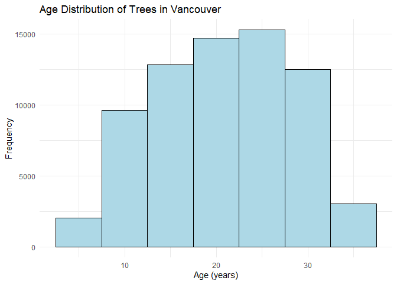
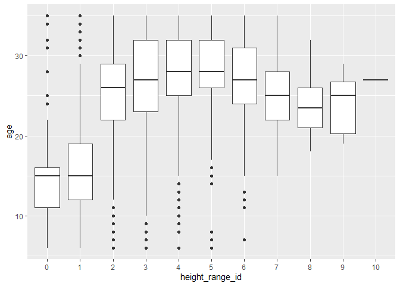

# Welcome to your (maybe) first-ever data analysis project!

And hopefully the first of many. Let’s get started:

1.  Install the [`datateachr`](https://github.com/UBC-MDS/datateachr)
    package by typing the following into your **R terminal**:

<!-- -->

    install.packages("devtools")
    devtools::install_github("UBC-MDS/datateachr")

1.  Load the packages below.

<!-- -->

    library(datateachr)
    library(tidyverse)

    ## ── Attaching core tidyverse packages ──────────────────────── tidyverse 2.0.0 ──
    ## ✔ dplyr     1.1.4     ✔ readr     2.1.5
    ## ✔ forcats   1.0.0     ✔ stringr   1.5.1
    ## ✔ ggplot2   3.5.2     ✔ tibble    3.3.0
    ## ✔ lubridate 1.9.3     ✔ tidyr     1.3.1
    ## ✔ purrr     1.0.2     
    ## ── Conflicts ────────────────────────────────────────── tidyverse_conflicts() ──
    ## ✖ dplyr::filter() masks stats::filter()
    ## ✖ dplyr::lag()    masks stats::lag()
    ## ℹ Use the conflicted package (<http://conflicted.r-lib.org/>) to force all conflicts to become errors

1.  Make a repository in the <https://github.com/stat545ubc-2024>
    Organization. You can do this by following the steps found on canvas
    in the entry called [MDA: Create a
    repository](https://canvas.ubc.ca/courses/158528/pages/mda-create-a-repository).
    One completed, your repository should automatically be listed as
    part of the stat545ubc-2024 Organization.

# Instructions

## For Both Milestones

-   Each milestone has explicit tasks. Tasks that are more challenging
    will often be allocated more points.

-   Each milestone will be also graded for reproducibility, cleanliness,
    and coherence of the overall Github submission.

-   While the two milestones will be submitted as independent
    deliverables, the analysis itself is a continuum - think of it as
    two chapters to a story. Each chapter, or in this case, portion of
    your analysis, should be easily followed through by someone
    unfamiliar with the content.
    [Here](https://swcarpentry.github.io/r-novice-inflammation/06-best-practices-R.html)
    is a good resource for what constitutes “good code”. Learning good
    coding practices early in your career will save you hassle later on!

-   The milestones will be equally weighted.

## For Milestone 1

**To complete this milestone**, edit [this very `.Rmd`
file](https://raw.githubusercontent.com/UBC-STAT/stat545.stat.ubc.ca/master/content/mini-project/mini-project-1.Rmd)
directly. Fill in the sections that are tagged with
`<!--- start your work below --->`.

**To submit this milestone**, make sure to knit this `.Rmd` file to an
`.md` file by changing the YAML output settings from
`output: html_document` to `output: github_document`. Commit and push
all of your work to the mini-analysis GitHub repository you made
earlier, and tag a release on GitHub. Then, submit a link to your tagged
release on canvas.

**Points**: This milestone is worth 36 points: 30 for your analysis, and
6 for overall reproducibility, cleanliness, and coherence of the Github
submission.

# Learning Objectives

By the end of this milestone, you should:

-   Become familiar with your dataset of choosing
-   Select 4 questions that you would like to answer with your data
-   Generate a reproducible and clear report using R Markdown
-   Become familiar with manipulating and summarizing your data in
    tibbles using `dplyr`, with a research question in mind.

# Task 1: Choose your favorite dataset

The `datateachr` package by Hayley Boyce and Jordan Bourak currently
composed of 7 semi-tidy datasets for educational purposes. Here is a
brief description of each dataset:

-   *apt\_buildings*: Acquired courtesy of The City of Toronto’s Open
    Data Portal. It currently has 3455 rows and 37 columns.

-   *building\_permits*: Acquired courtesy of The City of Vancouver’s
    Open Data Portal. It currently has 20680 rows and 14 columns.

-   *cancer\_sample*: Acquired courtesy of UCI Machine Learning
    Repository. It currently has 569 rows and 32 columns.

-   *flow\_sample*: Acquired courtesy of The Government of Canada’s
    Historical Hydrometric Database. It currently has 218 rows and 7
    columns.

-   *parking\_meters*: Acquired courtesy of The City of Vancouver’s Open
    Data Portal. It currently has 10032 rows and 22 columns.

-   *steam\_games*: Acquired courtesy of Kaggle. It currently has 40833
    rows and 21 columns.

-   *vancouver\_trees*: Acquired courtesy of The City of Vancouver’s
    Open Data Portal. It currently has 146611 rows and 20 columns.

**Things to keep in mind**

-   We hope that this project will serve as practice for carrying our
    your own *independent* data analysis. Remember to comment your code,
    be explicit about what you are doing, and write notes in this
    markdown document when you feel that context is required. As you
    advance in the project, prompts and hints to do this will be
    diminished - it’ll be up to you!

-   Before choosing a dataset, you should always keep in mind **your
    goal**, or in other ways, *what you wish to achieve with this data*.
    This mini data-analysis project focuses on *data wrangling*,
    *tidying*, and *visualization*. In short, it’s a way for you to get
    your feet wet with exploring data on your own.

And that is exactly the first thing that you will do!

1.1 **(1 point)** Out of the 7 datasets available in the `datateachr`
package, choose **4** that appeal to you based on their description.
Write your choices below:

**Note**: We encourage you to use the ones in the `datateachr` package,
but if you have a dataset that you’d really like to use, you can include
it here. But, please check with a member of the teaching team to see
whether the dataset is of appropriate complexity. Also, include a
**brief** description of the dataset here to help the teaching team
understand your data.

<!-------------------------- Start your work below ---------------------------->

My top four dataset choices, based on the simple descriptions provided
above, are:

1: CHOICE\_1 *vancouver\_trees* 2: CHOICE\_2 *steam\_games* 3: CHOICE\_3
*flow\_sample* 4: CHOICE\_4 *cancer\_sample*

<!----------------------------------------------------------------------------->

1.2 **(6 points)** One way to narrowing down your selection is to
*explore* the datasets. Use your knowledge of dplyr to find out at least
*3* attributes about each of these datasets (an attribute is something
such as number of rows, variables, class type…). The goal here is to
have an idea of *what the data looks like*.

*Hint:* This is one of those times when you should think about the
cleanliness of your analysis. I added a single code chunk for you below,
but do you want to use more than one? Would you like to write more
comments outside of the code chunk?

<!-------------------------- Start your work below ---------------------------->

First, I explored the headings to understand the type of data provided
within each dataset:

    ### EXPLORE HERE ###
    head(vancouver_trees)

    ## # A tibble: 6 × 20
    ##   tree_id civic_number std_street genus_name species_name cultivar_name  
    ##     <dbl>        <dbl> <chr>      <chr>      <chr>        <chr>          
    ## 1  149556          494 W 58TH AV  ULMUS      AMERICANA    BRANDON        
    ## 2  149563          450 W 58TH AV  ZELKOVA    SERRATA      <NA>           
    ## 3  149579         4994 WINDSOR ST STYRAX     JAPONICA     <NA>           
    ## 4  149590          858 E 39TH AV  FRAXINUS   AMERICANA    AUTUMN APPLAUSE
    ## 5  149604         5032 WINDSOR ST ACER       CAMPESTRE    <NA>           
    ## 6  149616          585 W 61ST AV  PYRUS      CALLERYANA   CHANTICLEER    
    ## # ℹ 14 more variables: common_name <chr>, assigned <chr>, root_barrier <chr>,
    ## #   plant_area <chr>, on_street_block <dbl>, on_street <chr>,
    ## #   neighbourhood_name <chr>, street_side_name <chr>, height_range_id <dbl>,
    ## #   diameter <dbl>, curb <chr>, date_planted <date>, longitude <dbl>,
    ## #   latitude <dbl>

    head(steam_games)

    ## # A tibble: 6 × 21
    ##      id url     types name  desc_snippet recent_reviews all_reviews release_date
    ##   <dbl> <chr>   <chr> <chr> <chr>        <chr>          <chr>       <chr>       
    ## 1     1 https:… app   DOOM  Now include… Very Positive… Very Posit… May 12, 2016
    ## 2     2 https:… app   PLAY… PLAYERUNKNO… Mixed,(6,214)… Mixed,(836… Dec 21, 2017
    ## 3     3 https:… app   BATT… Take comman… Mixed,(166),-… Mostly Pos… Apr 24, 2018
    ## 4     4 https:… app   DayZ  The post-so… Mixed,(932),-… Mixed,(167… Dec 13, 2018
    ## 5     5 https:… app   EVE … EVE Online … Mixed,(287),-… Mostly Pos… May 6, 2003 
    ## 6     6 https:… bund… Gran… Grand Theft… NaN            NaN         NaN         
    ## # ℹ 13 more variables: developer <chr>, publisher <chr>, popular_tags <chr>,
    ## #   game_details <chr>, languages <chr>, achievements <dbl>, genre <chr>,
    ## #   game_description <chr>, mature_content <chr>, minimum_requirements <chr>,
    ## #   recommended_requirements <chr>, original_price <dbl>, discount_price <dbl>

    head(flow_sample)

    ## # A tibble: 6 × 7
    ##   station_id  year extreme_type month   day  flow sym  
    ##   <chr>      <dbl> <chr>        <dbl> <dbl> <dbl> <chr>
    ## 1 05BB001     1909 maximum          7     7   314 <NA> 
    ## 2 05BB001     1910 maximum          6    12   230 <NA> 
    ## 3 05BB001     1911 maximum          6    14   264 <NA> 
    ## 4 05BB001     1912 maximum          8    25   174 <NA> 
    ## 5 05BB001     1913 maximum          6    11   232 <NA> 
    ## 6 05BB001     1914 maximum          6    18   214 <NA>

    head(cancer_sample)

    ## # A tibble: 6 × 32
    ##         ID diagnosis radius_mean texture_mean perimeter_mean area_mean
    ##      <dbl> <chr>           <dbl>        <dbl>          <dbl>     <dbl>
    ## 1   842302 M                18.0         10.4          123.      1001 
    ## 2   842517 M                20.6         17.8          133.      1326 
    ## 3 84300903 M                19.7         21.2          130       1203 
    ## 4 84348301 M                11.4         20.4           77.6      386.
    ## 5 84358402 M                20.3         14.3          135.      1297 
    ## 6   843786 M                12.4         15.7           82.6      477.
    ## # ℹ 26 more variables: smoothness_mean <dbl>, compactness_mean <dbl>,
    ## #   concavity_mean <dbl>, concave_points_mean <dbl>, symmetry_mean <dbl>,
    ## #   fractal_dimension_mean <dbl>, radius_se <dbl>, texture_se <dbl>,
    ## #   perimeter_se <dbl>, area_se <dbl>, smoothness_se <dbl>,
    ## #   compactness_se <dbl>, concavity_se <dbl>, concave_points_se <dbl>,
    ## #   symmetry_se <dbl>, fractal_dimension_se <dbl>, radius_worst <dbl>,
    ## #   texture_worst <dbl>, perimeter_worst <dbl>, area_worst <dbl>, …

Then, I looked at the total number of rows in each dataset to compare
their sizes:

    ### EXPLORE HERE ###
    nrow(vancouver_trees) #146611

    ## [1] 146611

    nrow(steam_games) #40833

    ## [1] 40833

    nrow(flow_sample) #218

    ## [1] 218

    nrow(cancer_sample) #569

    ## [1] 569

Lastly, I looked at the class type of each dataset:

    ### EXPLORE HERE ###
    class(vancouver_trees)

    ## [1] "tbl_df"     "tbl"        "data.frame"

    class(steam_games)

    ## [1] "spec_tbl_df" "tbl_df"      "tbl"         "data.frame"

    class(flow_sample)

    ## [1] "tbl_df"     "tbl"        "data.frame"

    class(cancer_sample)

    ## [1] "spec_tbl_df" "tbl_df"      "tbl"         "data.frame"

<!----------------------------------------------------------------------------->

1.3 **(1 point)** Now that you’ve explored the 4 datasets that you were
initially most interested in, let’s narrow it down to 1. What lead you
to choose this one? Briefly explain your choice below.

<!-------------------------- Start your work below ---------------------------->

I am most interested in the *vancouver\_trees* dataset because of the
variety of data found in this collection as well as the large number of
data entries. I also thought the way each column was organized was very
intuitive unlike some of the other datasets that may have had more
information about each entry but less entries overall. I also liked that
it was local to Vancouver!
<!----------------------------------------------------------------------------->

1.4 **(2 points)** Time for a final decision! Going back to the
beginning, it’s important to have an *end goal* in mind. For example, if
I had chosen the `titanic` dataset for my project, I might’ve wanted to
explore the relationship between survival and other variables. Try to
think of 1 research question that you would want to answer with your
dataset. Note it down below.

<!-------------------------- Start your work below ---------------------------->

How do characteristics of the trees found in Vancouver vary by
neighborhood?
<!----------------------------------------------------------------------------->

# Important note

Read Tasks 2 and 3 *fully* before starting to complete either of them.
Probably also a good point to grab a coffee to get ready for the fun
part!

This project is semi-guided, but meant to be *independent*. For this
reason, you will complete tasks 2 and 3 below (under the **START HERE**
mark) as if you were writing your own exploratory data analysis report,
and this guidance never existed! Feel free to add a brief introduction
section to your project, format the document with markdown syntax as you
deem appropriate, and structure the analysis as you deem appropriate. If
you feel lost, you can find a sample data analysis
[here](https://www.kaggle.com/headsortails/tidy-titarnic) to have a
better idea. However, bear in mind that it is **just an example** and
you will not be required to have that level of complexity in your
project.

# Task 2: Exploring your dataset

If we rewind and go back to the learning objectives, you’ll see that by
the end of this deliverable, you should have formulated *4* research
questions about your data that you may want to answer during your
project. However, it may be handy to do some more exploration on your
dataset of choice before creating these questions - by looking at the
data, you may get more ideas. **Before you start this task, read all
instructions carefully until you reach START HERE under Task 3**.

2.1 **(12 points)** Complete *4 out of the following 8 exercises* to
dive deeper into your data. All datasets are different and therefore,
not all of these tasks may make sense for your data - which is why you
should only answer *4*.

Make sure that you’re using dplyr and ggplot2 rather than base R for
this task. Outside of this project, you may find that you prefer using
base R functions for certain tasks, and that’s just fine! But part of
this project is for you to practice the tools we learned in class, which
is dplyr and ggplot2.

2.2 **(4 points)** For each of the 4 exercises that you complete,
provide a *brief explanation* of why you chose that exercise in relation
to your data (in other words, why does it make sense to do that?), and
sufficient comments for a reader to understand your reasoning and code.

<!-------------------------- Start your work below ---------------------------->

**5. Filter observations in your data according to your own criteria.**
When I first looked at the headings of this dataset, I noticed that many
of them corresponded to the location of each tree. Then, I noticed that
there was a convenient column that listed the neighborhood of each tree,
and I wondered how many trees were present in the neighborhood I live
in. UBC campus was not included, so I discovered that another familiar
neighborhood, West Point Grey, had 4939 trees.

    # Goal 1: Find if my neighborhood (UBC campus) is included in the dataset
    vancouver_trees$neighbourhood_name <- as.factor(vancouver_trees$neighbourhood_name)
    levels(vancouver_trees$neighbourhood_name)

    ##  [1] "ARBUTUS-RIDGE"            "DOWNTOWN"                
    ##  [3] "DUNBAR-SOUTHLANDS"        "FAIRVIEW"                
    ##  [5] "GRANDVIEW-WOODLAND"       "HASTINGS-SUNRISE"        
    ##  [7] "KENSINGTON-CEDAR COTTAGE" "KERRISDALE"              
    ##  [9] "KILLARNEY"                "KITSILANO"               
    ## [11] "MARPOLE"                  "MOUNT PLEASANT"          
    ## [13] "OAKRIDGE"                 "RENFREW-COLLINGWOOD"     
    ## [15] "RILEY PARK"               "SHAUGHNESSY"             
    ## [17] "SOUTH CAMBIE"             "STRATHCONA"              
    ## [19] "SUNSET"                   "VICTORIA-FRASERVIEW"     
    ## [21] "WEST END"                 "WEST POINT GREY"

    #UBC campus was not included in this list, so I chose another neighborhood I am familiar with: West Point Grey.

    # Goal 2: Explore the number of entries within West Point Grey
    # filter for entries in West Point Grey and create a new table for this data
    wpg_trees <- filter(vancouver_trees, neighbourhood_name == "WEST POINT GREY")
    #find the number of entries for this neighborhood
    nrow(wpg_trees) # 4939 trees

    ## [1] 4939

**2. Create a new variable based on other variables in your data.** When
I was looking at the headings of this dataset, I noticed it included the
date planted. This led me to wondering if there was a more intuitive way
to investigate tree age (assuming that when planted they were
approximately the same age).

    ### Goal: Make a new variable called "age"
    ### Load lubridate library for "interval" and "time_length" functions when working with dates
    # install.packages("lubridate") if needed
    library(lubridate)

    #define current_date to improve reproducibility for future analysis
    current_date <- as.Date(rep("2025-10-02"))

    #name this dataset with current year to improve reproducibility
    vancouver_trees2025 <- vancouver_trees %>%
                              mutate(age = interval(date_planted, current_date) %>%
                              time_length(unit = "years") %>%
                              trunc())
                                
    #check headings to make sure the column was made correctly!
    head(vancouver_trees2025)

    ## # A tibble: 6 × 21
    ##   tree_id civic_number std_street genus_name species_name cultivar_name  
    ##     <dbl>        <dbl> <chr>      <chr>      <chr>        <chr>          
    ## 1  149556          494 W 58TH AV  ULMUS      AMERICANA    BRANDON        
    ## 2  149563          450 W 58TH AV  ZELKOVA    SERRATA      <NA>           
    ## 3  149579         4994 WINDSOR ST STYRAX     JAPONICA     <NA>           
    ## 4  149590          858 E 39TH AV  FRAXINUS   AMERICANA    AUTUMN APPLAUSE
    ## 5  149604         5032 WINDSOR ST ACER       CAMPESTRE    <NA>           
    ## 6  149616          585 W 61ST AV  PYRUS      CALLERYANA   CHANTICLEER    
    ## # ℹ 15 more variables: common_name <chr>, assigned <chr>, root_barrier <chr>,
    ## #   plant_area <chr>, on_street_block <dbl>, on_street <chr>,
    ## #   neighbourhood_name <fct>, street_side_name <chr>, height_range_id <dbl>,
    ## #   diameter <dbl>, curb <chr>, date_planted <date>, longitude <dbl>,
    ## #   latitude <dbl>, age <dbl>

**1. Plot the distribution of a numeric variable.** Using this new age
variable that I made, I wanted to explore the age distribution of trees
in Vancouver. I used ggplot2 to visualize this, and found that the trees
have a distribution that is slightly skewed left, with the majority of
trees being between 20 and 30 years of age. However, 76548 rows had no
recorded plant date, which is about half the number of entries in the
table and raises questions about why we don’t have that data. Perhaps
they started or stopped recording plant date at certain times in
history?

    #Goal: Create a histogram using ggplot2 to visualize tree age distribution.
    ggplot(vancouver_trees2025, aes(x = age)) +
          geom_histogram(binwidth = 5, fill = "lightblue", color = "black") +
          labs(title = "Age Distribution of Trees in Vancouver",
               x = "Age (years)",
               y = "Frequency") +
          theme_minimal()

    ## Warning: Removed 76548 rows containing non-finite outside the scale range
    ## (`stat_bin()`).

**6. Use a boxplot to look at the frequency of different observations
within a single variable.** I was interested to see if the
height\_range\_id was correlated with age at all. I predicted that trees
that fall within a higher height\_range\_id would be older, but I was
not sure how this variable was defined, and this analysis would likely
help me define it. When I created the boxplot, it was evident that there
were several outliers and that maybe this boxplot is not the best
visualization of height vs. age. But it seemed that trees with a smaller
height\_range\_id tend to be younger, so my prediction could still be
correct.

    #Goal: Create a series of boxplots comparing age distribution by height ID (read as factor)
    vancouver_trees2025$height_range_id <-as.factor(vancouver_trees2025$height_range_id)
    ggplot(vancouver_trees2025, aes(x = height_range_id, y = age)) +
      geom_boxplot()

    ## Warning: Removed 76548 rows containing non-finite outside the scale range
    ## (`stat_boxplot()`).

<!----------------------------------------------------------------------------->

# Task 3: Choose research questions

**(4 points)** So far, you have chosen a dataset and gotten familiar
with it through exploring the data. You have also brainstormed one
research question that interested you (Task 1.4). Now it’s time to pick
4 research questions that you would like to explore in Milestone 2!
Write the 4 questions and any additional comments below.

<!--- *****START HERE***** --->

Four research questions I would like to explore in Milestone 2 are:

1.  How do tree age distributions compare between Vancouver
    neighborhoods?
2.  What are the most common trees in Vancouver? Do these vary by
    neighborhood?
3.  What is the relationship between tree age and height?
4.  In regards to exploring tree age vs. height, are some species common
    outliers?

<!----------------------------->

# Overall reproducibility/Cleanliness/Coherence Checklist

## Coherence (0.5 points)

The document should read sensibly from top to bottom, with no major
continuity errors. An example of a major continuity error is having a
data set listed for Task 3 that is not part of one of the data sets
listed in Task 1.

## Error-free code (3 points)

For full marks, all code in the document should run without error. 1
point deduction if most code runs without error, and 2 points deduction
if more than 50% of the code throws an error.

## Main README (1 point)

There should be a file named `README.md` at the top level of your
repository. Its contents should automatically appear when you visit the
repository on GitHub.

Minimum contents of the README file:

-   In a sentence or two, explains what this repository is, so that
    future-you or someone else stumbling on your repository can be
    oriented to the repository.
-   In a sentence or two (or more??), briefly explains how to engage
    with the repository. You can assume the person reading knows the
    material from STAT 545A. Basically, if a visitor to your repository
    wants to explore your project, what should they know?

Once you get in the habit of making README files, and seeing more README
files in other projects, you’ll wonder how you ever got by without them!
They are tremendously helpful.

## Output (1 point)

All output is readable, recent and relevant:

-   All Rmd files have been `knit`ted to their output md files.
-   All knitted md files are viewable without errors on Github. Examples
    of errors: Missing plots, “Sorry about that, but we can’t show files
    that are this big right now” messages, error messages from broken R
    code
-   All of these output files are up-to-date – that is, they haven’t
    fallen behind after the source (Rmd) files have been updated.
-   There should be no relic output files. For example, if you were
    knitting an Rmd to html, but then changed the output to be only a
    markdown file, then the html file is a relic and should be deleted.

(0.5 point deduction if any of the above criteria are not met. 1 point
deduction if most or all of the above criteria are not met.)

Our recommendation: right before submission, delete all output files,
and re-knit each milestone’s Rmd file, so that everything is up to date
and relevant. Then, after your final commit and push to Github, CHECK on
Github to make sure that everything looks the way you intended!

## Tagged release (0.5 points)

You’ve tagged a release for Milestone 1.

### Attribution

Thanks to Icíar Fernández Boyano for mostly putting this together, and
Vincenzo Coia for launching.
