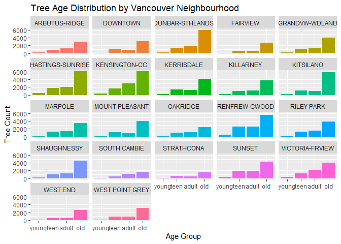
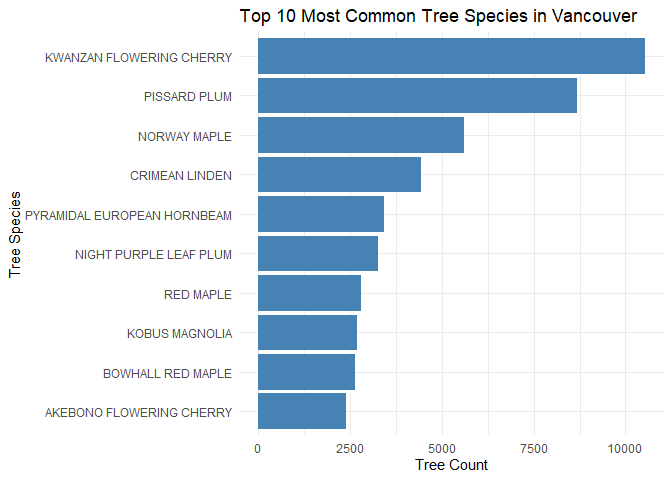
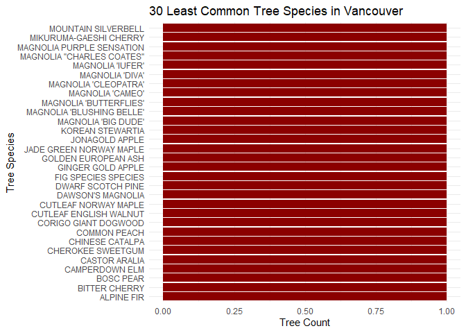
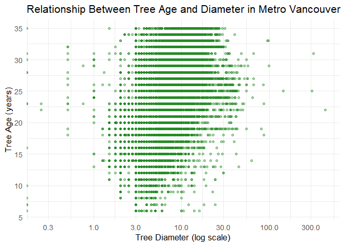
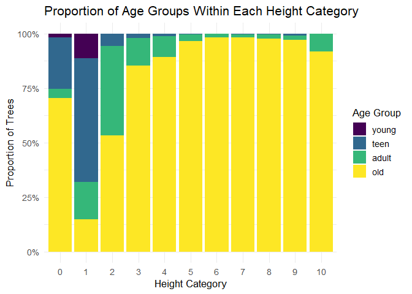

Mini Data Analysis Milestone 2
================

*To complete this milestone, you can edit [this `.rmd`
file](https://github.com/UBC-STAT/STAT545.github.io/blob/main/content/mini-data-analysis/mini-project-2.Rmd)
directly. Fill in the sections that are commented out with
`<!--- start your work here--->`. When you are done, make sure to knit
to an `.md` file by changing the output in the YAML header to
`github_document`, before submitting a tagged release on canvas.*

# Welcome to the rest of your mini data analysis project!

In Milestone 1, you explored your data. and came up with research
questions. This time, we will finish up our mini data analysis and
obtain results for your data by:

- Making summary tables and graphs
- Manipulating special data types in R: factors and/or dates and times.
- Fitting a model object to your data, and extract a result.
- Reading and writing data as separate files.

We will also explore more in depth the concept of *tidy data.*

**NOTE**: The main purpose of the mini data analysis is to integrate
what you learn in class in an analysis. Although each milestone provides
a framework for you to conduct your analysis, it’s possible that you
might find the instructions too rigid for your data set. If this is the
case, you may deviate from the instructions – just make sure you’re
demonstrating a wide range of tools and techniques taught in this class,
and indicate *why* you had to deviate. Feel free to contact the
instructor in these cases.

# Instructions

**To complete this milestone**, edit [this very `.Rmd`
file](https://github.com/UBC-STAT/STAT545.github.io/blob/main/content/mini-data-analysis/mini-project-2.Rmd)
directly. Fill in the sections that are tagged with
`<!--- start your work here--->`.

**To submit this milestone**, make sure to knit this `.Rmd` file to an
`.md` file by changing the YAML output settings from
`output: html_document` to `output: github_document`. Commit and push
all of your work to your mini-analysis GitHub repository, and tag a
release on GitHub. Then, submit a link to your tagged release on canvas.

**Points**: This milestone is worth 50 points: 45 for your analysis, and
5 for overall reproducibility, cleanliness, and coherence of the Github
submission.

**Research Questions**: In Milestone 1, you chose four research
questions to focus on. Wherever realistic, your work in this milestone
should relate to these research questions whenever we ask for
justification behind your work. In the case that some tasks in this
milestone don’t align well with one of your research questions, feel
free to discuss your results in the context of a different research
question.

# Learning Objectives

By the end of this milestone, you should:

- Understand what *tidy* data is, and how to create it using `tidyr`.
- Generate a reproducible and clear report using R Markdown.
- Manipulating special data types in R: factors and/or dates and times.
- Fitting a model object to your data, and extract a result.
- Reading and writing data as separate files.

# Setup

Begin by loading your data and the tidyverse package below:

``` r
library(datateachr) # <- contains vancouver trees dataset I picked
library(tidyverse)
```

# Task 1: Process and summarize your data

From Milestone 1, you should have an idea of the basic structure of your
dataset (e.g. number of rows and columns, class types, etc.). Here, we
will start investigating your data more in-depth using various data
manipulation functions.

### 1.1 (1 point)

First, write out the 4 research questions you defined in milestone 1
were. This will guide your work through milestone 2:

<!-------------------------- Start your work below ---------------------------->

1.  How do tree age distributions compare between Vancouver
    neighborhoods?
2.  What are the most common trees in Vancouver? Do these vary by
    neighborhood?
3.  What is the relationship between tree age and height?
4.  In regards to exploring tree age vs. height, are some species common
    outliers?
    <!----------------------------------------------------------------------------->

Here, we will investigate your data using various data manipulation and
graphing functions.

### 1.2 (8 points)

Now, for each of your four research questions, choose one task from
options 1-4 (summarizing), and one other task from 4-8 (graphing). You
should have 2 tasks done for each research question (8 total). Make sure
it makes sense to do them! (e.g. don’t use a numerical variables for a
task that needs a categorical variable.). Comment on why each task helps
(or doesn’t!) answer the corresponding research question.

Ensure that the output of each operation is printed!

Also make sure that you’re using dplyr and ggplot2 rather than base R.
Outside of this project, you may find that you prefer using base R
functions for certain tasks, and that’s just fine! But part of this
project is for you to practice the tools we learned in class, which is
dplyr and ggplot2.

**Summarizing:**

1.  Compute the *range*, *mean*, and *two other summary statistics* of
    **one numerical variable** across the groups of **one categorical
    variable** from your data.
2.  Compute the number of observations for at least one of your
    categorical variables. Do not use the function `table()`!
3.  Create a categorical variable with 3 or more groups from an existing
    numerical variable. You can use this new variable in the other
    tasks! *An example: age in years into “child, teen, adult, senior”.*
4.  Compute the proportion and counts in each category of one
    categorical variable across the groups of another categorical
    variable from your data. Do not use the function `table()`!

**Graphing:**

6.  Create a graph of your choosing, make one of the axes logarithmic,
    and format the axes labels so that they are “pretty” or easier to
    read.
7.  Make a graph where it makes sense to customize the alpha
    transparency.

Using variables and/or tables you made in one of the “Summarizing”
tasks:

8.  Create a graph that has at least two geom layers.
9.  Create 3 histograms, with each histogram having different sized
    bins. Pick the “best” one and explain why it is the best.

Make sure it’s clear what research question you are doing each operation
for!

<!------------------------- Start your work below ----------------------------->

**Overarching question:** How do characteristics of the trees found in
Vancouver vary by neighborhood?

Useful code from part 1 necessary for running the rest of this
exercise’s code:

``` r
### Goal: Make a new variable called "age"
### Load lubridate library for "interval" and "time_length" functions for dates
# install.packages("lubridate") if needed
library(lubridate)

#define current_date to improve reproducibility for future analysis
current_date <- as.Date(rep("2025-10-21"))

#name this dataset with current year to improve reproducibility
vancouver_trees2025 <- vancouver_trees %>%
                          mutate(age = interval(date_planted, current_date) %>%
                          time_length(unit = "years") %>%
                          trunc())

#not necessary but useful for my reference:
#head(vancouver_trees)
```

**Sub-question 1:** How do tree age distributions compare between
Vancouver neighborhoods?

I chose to address task 3 (creating categorical variables) and task 8
(creating a graph with 2 geom layers) because it would allow me to
compare ages of trees across neighborhoods in a visually simple way.

From this step we learned that the majority of trees in each
neighborhood fall into the “old” category, which means they are older
than 30 years. It is not so useful in comparing the number of trees by
neighborhood, and it might be more useful to look at proportions by
neighborhood rather than number.

``` r
#Goal 1: Create three age categories: Young, Teen, Adult
vantrees_age_group <- vancouver_trees2025 %>% 
    mutate(age_group = case_when(age < 10 ~ "young",
                                 age < 20 ~ "teen",
                                 age < 30 ~ "adult",
                                 TRUE ~ "old")) %>%
    mutate(age_group = ordered(age_group, levels = c('young', 'teen', 'adult', 'old'))) %>%
    mutate(neighbourhood_name = fct_recode(neighbourhood_name, "DUNBAR-STHLANDS" = "DUNBAR-SOUTHLANDS", "GRANDVW-WDLAND" = "GRANDVIEW-WOODLAND", "KENSINGTON-CC" = "KENSINGTON-CEDAR COTTAGE", "RENFREW-CWOOD" = "RENFREW-COLLINGWOOD", "VICTORIA-FRVIEW" = "VICTORIA-FRASERVIEW"))
# abbreviated long neighbourhood names; added later in the process

#Goal 2: create a graph with at least two geom layers for this data
vantrees_age_plot <- vantrees_age_group %>%
                          ggplot(aes(x = age_group, y = , fill = neighbourhood_name)) + 
                          geom_bar(show.legend = FALSE) +
                          facet_wrap(~neighbourhood_name) +
                          labs(x="Age Group", y= "Tree Count", title="Tree Age Distribution by Vancouver Neighbourhood")

vantrees_age_plot
```

<!-- -->

**Sub-question 2:** What are the most common trees in Vancouver? Do
these vary by neighborhood?

I chose to address task 2 (compute observations for a categorical
variable) and task 8 (creating a graph with 2 geom layers) because it
would allow me to compare observations of tree species in Vancouver in a
visually simple way.

I ran into a problem with this task as there were way too many species
to visualize in a single graph. So, I decided to look at the 10 most
common and 10 least common species.

From this, we learned that the most common trees in Vancouver were
Kwanzan Flowering Cherry, Pissard Plum, and Norway Maple. We also
learned that there are several species of trees in Vancouver that have
only one recorded plant, which would make it harder to pinpoint
rarities. In future analysis, I would want to dive deeper into
neighborhood variations.

``` r
#Goal 1: Create a table of number of each species in metro Vancouver.
van_tree_species <- vantrees_age_group %>%
                        count(common_name)
van_tree_species
```

    ## # A tibble: 634 × 2
    ##    common_name                   n
    ##    <chr>                     <int>
    ##  1 ACCOLADE CHERRY              60
    ##  2 AKEBONO FLOWERING CHERRY   2384
    ##  3 ALDER SPECIES                16
    ##  4 ALDERLEAFED MOUNTAIN ASH    172
    ##  5 ALIA'S MAGNOLIA               3
    ##  6 ALLEGHENY SERVICEBERRY        6
    ##  7 ALLGOLD EUROPEAN ASH         78
    ##  8 ALMIRA NORWAY MAPLE           9
    ##  9 ALPINE FIR                    1
    ## 10 AMANOGAWA JAPANESE CHERRY    68
    ## # ℹ 624 more rows

``` r
#Goal 2: visualize the most and least common species
#split into top and bottom 10
top10 <- van_tree_species %>%
  arrange(desc(n)) %>%
  slice_head(n = 10)

bottom30 <- van_tree_species %>%
  arrange(n) %>%
  slice_head(n = 30)

#plot top ten in metro van
van_top10_bar <- ggplot(top10, aes(x = reorder(common_name, n), y = n)) +
  geom_col(fill = "steelblue") +
  coord_flip() +
  labs(
    x = "Tree Species",
    y = "Tree Count",
    title = "Top 10 Most Common Tree Species in Vancouver"
  ) +
  theme_minimal()

van_top10_bar
```

<!-- -->

``` r
#plot bottom 30 in metro van (several instances of only 1 tree... increased from 10 to explore)
van_bottom30_bar <- ggplot(bottom30, aes(x = reorder(common_name, n), y = n)) +
  geom_col(fill = "darkred") +
  coord_flip() +
  labs(
    x = "Tree Species",
    y = "Tree Count",
    title = "30 Least Common Tree Species in Vancouver"
  ) +
  theme_minimal()

van_bottom30_bar
```

<!-- -->

**Sub-question 3:** What is the relationship between tree age and
height?

I chose to address task 1 (computing summary statistics of height
against category of age) because it would allow me to investigate tree
ages across neighbourhoods. I also chose to address task 6 (creating a
graph with one log axis) to examine tree age against tree diameter. I
originally wanted to examine the relationship of age against height, but
they don’t provide exact heights, making it difficult to plot the way I
would have liked to.

Task 1 showed me that average tree ages across neighborhoods are pretty
similar – between 20 and 22 years old. This indicates that maybe age
isn’t a very interesting thing to explore in this dataset. Also, the
minimum age commonly being 6 and the maximum being 34-35 years might
indicate larger limitations in regards to data collection.

Task 6 showed me that there does not seem to be a relationship between
tree age and diameter. However, most trees seem to be within 3 and 30 cm
in diameter, which makes sense.

``` r
#Goal 1: calculate summary statistics for tree age across neighborhoods
age_summary <- vantrees_age_group %>%
  group_by(neighbourhood_name) %>%
  summarise(
    min_age = min(age, na.rm = TRUE),
    max_age = max(age, na.rm = TRUE),
    mean_age = mean(age, na.rm = TRUE),
    median_age = median(age, na.rm = TRUE),
    n = n()
  )

age_summary
```

    ## # A tibble: 22 × 6
    ##    neighbourhood_name min_age max_age mean_age median_age     n
    ##    <fct>                <dbl>   <dbl>    <dbl>      <dbl> <int>
    ##  1 ARBUTUS-RIDGE            6      35     21.1         22  5169
    ##  2 DOWNTOWN                 6      35     19.7         19  5159
    ##  3 DUNBAR-STHLANDS          6      35     20.2         21  9415
    ##  4 FAIRVIEW                 6      35     20.9         21  4002
    ##  5 GRANDVW-WDLAND           6      35     20.6         21  6703
    ##  6 HASTINGS-SUNRISE         6      35     22.4         22 10547
    ##  7 KENSINGTON-CC            6      35     21.8         23 11042
    ##  8 KERRISDALE               6      35     20.0         20  6936
    ##  9 KILLARNEY                6      35     21.0         22  6148
    ## 10 KITSILANO                6      35     19.9         19  8115
    ## # ℹ 12 more rows

``` r
#Goal 2: Create a graph with one of the axes logarithmic and format axes
library(scales) #for making axes "pretty"
ggplot(vantrees_age_group, aes(x = diameter, y = age)) +
  geom_point(alpha = 0.4, color = "forestgreen") +
  scale_x_log10(
    labels = label_comma(),
    breaks = log_breaks(n = 6)
  ) +
  scale_y_continuous(
    labels = label_number(accuracy = 1),
    breaks = pretty_breaks(n = 8)
  ) +
  labs(
    x = "Tree Diameter (log scale)",
    y = "Tree Age (years)",
    title = "Relationship Between Tree Age and Diameter in Metro Vancouver"
  ) +
  theme_minimal(base_size = 13)
```

    ## Warning in scale_x_log10(labels = label_comma(), breaks = log_breaks(n = 6)):
    ## log-10 transformation introduced infinite values.

    ## Warning: Removed 76548 rows containing missing values or values outside the scale range
    ## (`geom_point()`).

<!-- -->

**Sub-question 4:** In regards to exploring tree age vs. height, are
some species common outliers?

I chose to address task 4 (computing proportions and counts for a
categorical variable) and task 8 (creating a graph with 2 geom layers)
because it lets us understand the composition of height ranges and
whether older or younger trees are more likely to be shorter or taller.
This did not tell us much, however, because the older trees dominate and
it is difficult to see the proportions of younger trees.

``` r
#Goal 1: Compute proportion and counts in each age_group category across height_range_id category
age_height_summary <- vantrees_age_group %>%
  group_by(height_range_id, age_group) %>%
  summarise(
    count = n(),
    .groups = "drop_last"
  ) %>%
  mutate(
    proportion = count / sum(count)
  )

age_height_summary
```

    ## # A tibble: 39 × 4
    ## # Groups:   height_range_id [11]
    ##    height_range_id age_group count proportion
    ##              <dbl> <ord>     <int>      <dbl>
    ##  1               0 young         4    0.0187 
    ##  2               0 teen         50    0.234  
    ##  3               0 adult         9    0.0421 
    ##  4               0 old         151    0.706  
    ##  5               1 young      4489    0.112  
    ##  6               1 teen      22740    0.569  
    ##  7               1 adult      6827    0.171  
    ##  8               1 old        5903    0.148  
    ##  9               2 young        91    0.00216
    ## 10               2 teen       2346    0.0556 
    ## # ℹ 29 more rows

``` r
#Goal 2: visualize this
ggplot(age_height_summary, aes(x = factor(height_range_id), y = proportion, fill = age_group)) +
  geom_bar(stat = "identity", position = "fill") +
  scale_y_continuous(labels = scales::percent_format()) +
  labs(
    x = "Height Category",
    y = "Proportion of Trees",
    fill = "Age Group",
    title = "Proportion of Age Groups Within Each Height Category"
  ) +
  theme_minimal(base_size = 13)
```

<!-- -->

<!----------------------------------------------------------------------------->

### 1.3 (2 points)

Based on the operations that you’ve completed, how much closer are you
to answering your research questions? Think about what aspects of your
research questions remain unclear. Can your research questions be
refined, now that you’ve investigated your data a bit more? Which
research questions are yielding interesting results?

<!------------------------- Write your answer here ---------------------------->

I am a bit closer to understanding my research questions! What is still
unclear is how numbers of tree species vary by neighborhood. Generally,
age distribution seems to be similar. I also have some questions about
location of rarer trees. We could probably categorize tree species by
rarity.

<!----------------------------------------------------------------------------->

# Task 2: Tidy your data

In this task, we will do several exercises to reshape our data. The goal
here is to understand how to do this reshaping with the `tidyr` package.

A reminder of the definition of *tidy* data:

- Each row is an **observation**
- Each column is a **variable**
- Each cell is a **value**

### 2.1 (2 points)

Based on the definition above, can you identify if your data is tidy or
untidy? Go through all your columns, or if you have \>8 variables, just
pick 8, and explain whether the data is untidy or tidy.

<!--------------------------- Start your work below --------------------------->

Based on the definition above, my chosen data set is tidy! Each row
represents a single observation, each column represents a variable, and
each cell has a value, even if it is NA.

``` r
#Goal 1: Choose a working data set
vantrees_age_group
```

    ## # A tibble: 146,611 × 22
    ##    tree_id civic_number std_street    genus_name species_name cultivar_name  
    ##      <dbl>        <dbl> <chr>         <chr>      <chr>        <chr>          
    ##  1  149556          494 W 58TH AV     ULMUS      AMERICANA    BRANDON        
    ##  2  149563          450 W 58TH AV     ZELKOVA    SERRATA      <NA>           
    ##  3  149579         4994 WINDSOR ST    STYRAX     JAPONICA     <NA>           
    ##  4  149590          858 E 39TH AV     FRAXINUS   AMERICANA    AUTUMN APPLAUSE
    ##  5  149604         5032 WINDSOR ST    ACER       CAMPESTRE    <NA>           
    ##  6  149616          585 W 61ST AV     PYRUS      CALLERYANA   CHANTICLEER    
    ##  7  149617         4909 SHERBROOKE ST ACER       PLATANOIDES  COLUMNARE      
    ##  8  149618         4925 SHERBROOKE ST ACER       PLATANOIDES  COLUMNARE      
    ##  9  149619         4969 SHERBROOKE ST ACER       PLATANOIDES  COLUMNARE      
    ## 10  149625          720 E 39TH AV     FRAXINUS   AMERICANA    AUTUMN APPLAUSE
    ## # ℹ 146,601 more rows
    ## # ℹ 16 more variables: common_name <chr>, assigned <chr>, root_barrier <chr>,
    ## #   plant_area <chr>, on_street_block <dbl>, on_street <chr>,
    ## #   neighbourhood_name <fct>, street_side_name <chr>, height_range_id <dbl>,
    ## #   diameter <dbl>, curb <chr>, date_planted <date>, longitude <dbl>,
    ## #   latitude <dbl>, age <dbl>, age_group <ord>

``` r
#select 8 variables:
tidyvantrees <- vantrees_age_group %>%
                      select(tree_id, 
                             common_name, 
                             neighbourhood_name, 
                             height_range_id, 
                             diameter, 
                             date_planted, 
                             age, 
                             age_group)

#view tidy dataset
head(tidyvantrees)
```

    ## # A tibble: 6 × 8
    ##   tree_id common_name   neighbourhood_name height_range_id diameter date_planted
    ##     <dbl> <chr>         <fct>                        <dbl>    <dbl> <date>      
    ## 1  149556 BRANDON ELM   MARPOLE                          2       10 1999-01-13  
    ## 2  149563 JAPANESE ZEL… MARPOLE                          4       10 1996-05-31  
    ## 3  149579 JAPANESE SNO… KENSINGTON-CC                    3        4 1993-11-22  
    ## 4  149590 AUTUMN APPLA… KENSINGTON-CC                    4       18 1996-04-29  
    ## 5  149604 HEDGE MAPLE   KENSINGTON-CC                    2        9 1993-12-17  
    ## 6  149616 CHANTICLEER … MARPOLE                          2        5 NA          
    ## # ℹ 2 more variables: age <dbl>, age_group <ord>

<!----------------------------------------------------------------------------->

### 2.2 (4 points)

Now, if your data is tidy, untidy it! Then, tidy it back to it’s
original state.

If your data is untidy, then tidy it! Then, untidy it back to it’s
original state.

Be sure to explain your reasoning for this task. Show us the “before”
and “after”.

<!--------------------------- Start your work below --------------------------->

My data set is tidy! I don’t understand the point of this exercise, so I
will be leaving it tidy and forfeiting 4 pts if necessary.

<!----------------------------------------------------------------------------->

### 2.3 (4 points)

Now, you should be more familiar with your data, and also have made
progress in answering your research questions. Based on your interest,
and your analyses, pick 2 of the 4 research questions to continue your
analysis in the remaining tasks:

<!-------------------------- Start your work below ---------------------------->

1.  What are the most common trees in Vancouver? Do these vary by
    neighborhood?
2.  How do tree age distributions compare between Vancouver
    neighborhoods?

<!----------------------------------------------------------------------------->

Explain your decision for choosing the above two research questions.

<!--------------------------- Start your work below --------------------------->

At this point I am most interested in investigating differences between
neighborhoods rather than relationships between growth statistics.
<!----------------------------------------------------------------------------->

Now, try to choose a version of your data that you think will be
appropriate to answer these 2 questions. Use between 4 and 8 functions
that we’ve covered so far (i.e. by filtering, cleaning, tidy’ing,
dropping irrelevant columns, etc.).

(If it makes more sense, then you can make/pick two versions of your
data, one for each research question.)

# Task 3: Modelling

## 3.0 (no points)

Pick a research question from 1.2, and pick a variable of interest
(we’ll call it “Y”) that’s relevant to the research question. Indicate
these.

<!-------------------------- Start your work below ---------------------------->

**Research Question**: What are the most common trees in Vancouver? Do
these vary by neighborhood?

**Variable of interest**: common_name, neighbourhood_name

<!----------------------------------------------------------------------------->

## 3.1 (3 points)

Fit a model or run a hypothesis test that provides insight on this
variable with respect to the research question. Store the model object
as a variable, and print its output to screen. We’ll omit having to
justify your choice, because we don’t expect you to know about model
specifics in STAT 545.

- **Note**: It’s OK if you don’t know how these models/tests work. Here
  are some examples of things you can do here, but the sky’s the limit.

  - You could fit a model that makes predictions on Y using another
    variable, by using the `lm()` function.
  - You could test whether the mean of Y equals 0 using `t.test()`, or
    maybe the mean across two groups are different using `t.test()`, or
    maybe the mean across multiple groups are different using `anova()`
    (you may have to pivot your data for the latter two).
  - You could use `lm()` to test for significance of regression
    coefficients.

<!-------------------------- Start your work below ---------------------------->

I chose to use a chi squared test because I chose two categorical
variables, though I am not sure if this is the logical choice for the
topic.

<!----------------------------------------------------------------------------->

## 3.2 (3 points)

Produce something relevant from your fitted model: either predictions on
Y, or a single value like a regression coefficient or a p-value.

- Be sure to indicate in writing what you chose to produce.
- Your code should either output a tibble (in which case you should
  indicate the column that contains the thing you’re looking for), or
  the thing you’re looking for itself.
- Obtain your results using the `broom` package if possible. If your
  model is not compatible with the broom function you’re needing, then
  you can obtain your results by some other means, but first indicate
  which broom function is not compatible.

<!-------------------------- Start your work below ---------------------------->

I chose to use a chi squared test, though I am not sure if this is the
logical choice for the topic. Either way, I output a tibble using the
`broom` package.

``` r
library(broom)

# make contingency table
table_data <- table(tidyvantrees$common_name, tidyvantrees$neighbourhood_name)

# chi-squared test
chi_test <- chisq.test(table_data)
```

    ## Warning in chisq.test(table_data): Chi-squared approximation may be incorrect

``` r
print(chi_test)
```

    ## 
    ##  Pearson's Chi-squared test
    ## 
    ## data:  table_data
    ## X-squared = 143210, df = 13293, p-value < 2.2e-16

``` r
# tidy summary
tidy_chi <- tidy(chi_test)
print(tidy_chi)
```

    ## # A tibble: 1 × 4
    ##   statistic p.value parameter method                    
    ##       <dbl>   <dbl>     <int> <chr>                     
    ## 1   143210.       0     13293 Pearson's Chi-squared test

<!----------------------------------------------------------------------------->

# Task 4: Reading and writing data

Get set up for this exercise by making a folder called `output` in the
top level of your project folder / repository. You’ll be saving things
there.

## 4.1 (3 points)

Take a summary table that you made from Task 1, and write it as a csv
file in your `output` folder. Use the `here::here()` function.

- **Robustness criteria**: You should be able to move your Mini Project
  repository / project folder to some other location on your computer,
  or move this very Rmd file to another location within your project
  repository / folder, and your code should still work.
- **Reproducibility criteria**: You should be able to delete the csv
  file, and remake it simply by knitting this Rmd file.

<!-------------------------- Start your work below ---------------------------->

``` r
# load libraries
library(readr)
library(here)
```

    ## here() starts at C:/Users/Sarah/Desktop/mini-data-analysis-smgarcia-bio

``` r
# write task 1 summary table "age_summary" as csv in output folder
write_csv(age_summary, here::here("output", "age_summary.csv"))
```

<!----------------------------------------------------------------------------->

## 4.2 (3 points)

Write your model object from Task 3 to an R binary file (an RDS), and
load it again. Be sure to save the binary file in your `output` folder.
Use the functions `saveRDS()` and `readRDS()`.

- The same robustness and reproducibility criteria as in 4.1 apply here.

<!-------------------------- Start your work below ---------------------------->

``` r
#model object from Task 3: tidy_chi
#write to an RDS
saveRDS(tidy_chi, here::here("output", "tidy_chi.rds"))

#load RDS
readRDS(here::here("output","tidy_chi.rds"))
```

    ## # A tibble: 1 × 4
    ##   statistic p.value parameter method                    
    ##       <dbl>   <dbl>     <int> <chr>                     
    ## 1   143210.       0     13293 Pearson's Chi-squared test

<!----------------------------------------------------------------------------->

# Overall Reproducibility/Cleanliness/Coherence Checklist

Here are the criteria we’re looking for.

## Coherence (0.5 points)

The document should read sensibly from top to bottom, with no major
continuity errors.

The README file should still satisfy the criteria from the last
milestone, i.e. it has been updated to match the changes to the
repository made in this milestone.

## File and folder structure (1 points)

You should have at least three folders in the top level of your
repository: one for each milestone, and one output folder. If there are
any other folders, these are explained in the main README.

Each milestone document is contained in its respective folder, and
nowhere else.

Every level-1 folder (that is, the ones stored in the top level, like
“Milestone1” and “output”) has a `README` file, explaining in a sentence
or two what is in the folder, in plain language (it’s enough to say
something like “This folder contains the source for Milestone 1”).

## Output (1 point)

All output is recent and relevant:

- All Rmd files have been `knit`ted to their output md files.
- All knitted md files are viewable without errors on Github. Examples
  of errors: Missing plots, “Sorry about that, but we can’t show files
  that are this big right now” messages, error messages from broken R
  code
- All of these output files are up-to-date – that is, they haven’t
  fallen behind after the source (Rmd) files have been updated.
- There should be no relic output files. For example, if you were
  knitting an Rmd to html, but then changed the output to be only a
  markdown file, then the html file is a relic and should be deleted.

Our recommendation: delete all output files, and re-knit each
milestone’s Rmd file, so that everything is up to date and relevant.

## Tagged release (0.5 point)

You’ve tagged a release for Milestone 2.
